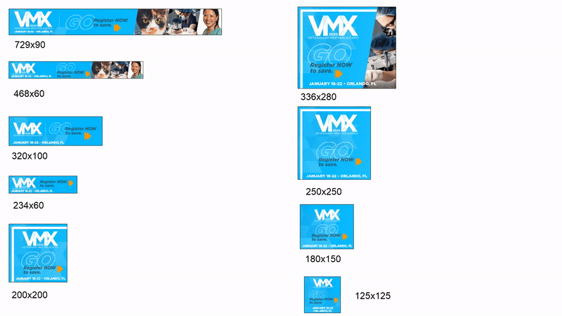

# VMX Banners Ads

### Intro
I make HTML5 banner ads for clients using HTML/CSS and a javascript library called GSAP for smooth animations. 

### General info
Each set of banner has different sizes depending on the sizes the client wants, as well as the PSD files behind the design of the ad. Multiple sets means the client came back for more ads, and will often have totally different designs. To view each ad, simply click the index.html file in each folder. Make sure ad block is off since these ads don't work with ad block. 

### Demos
Here are some of the sizes made for VMX. 
[Here](https://drive.google.com/drive/folders/1gGvX6wv0gy4Ig4ICRV2haUd1FfPtq82L?usp=sharing) is a link for banners I'm able to show. 



### Tech
```HTML, CSS, Javascript```
